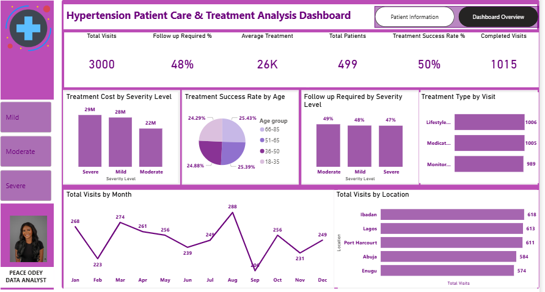
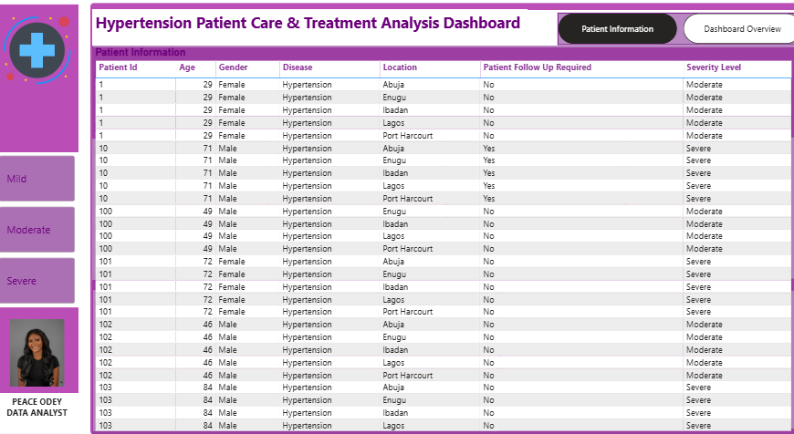

# Hypertension-Patient-Care-Treatment-Analysis

**Power BI Case Study – Tender Heart Specialist Hospital**


##  Project Summary

This project analyzes 12 months of hypertension patient visit data to evaluate treatment outcomes, cost drivers, follow-up patterns, and visit trends. Using Power BI, I built a star schema data model and an interactive dashboard to support data-driven healthcare planning, resource allocation, and improved patient care management.


##  Project Overview

Tender Heart Specialist Hospital is a healthcare provider operating in the clinical care industry.

This project examines cardiology department data from **January–December 2014** to understand:

* Hypertension treatment effectiveness
* Patient visit trends
* Treatment cost distribution
* Follow-up requirements
* High-risk patient segments

The analysis was conducted in **Power BI** using data modeling, DAX measures, and interactive visualizations.


##  Problem Statement

The Cardiology department required improved visibility into:

* Fluctuating patient visit trends
* Rising treatment costs
* Follow-up demand levels
* Treatment success rates across patient groups

The objective was to identify cost drivers, high-risk segments, and opportunities to optimize treatment effectiveness and operational planning.


##  Data Source

* **Dataset Type:** Simulated hospital cardiology dataset
* **Time Period:** January – December 2014
* **Records:** 3,000 patient visits
* **Unique Patients:** 499

### Key Fields:

* Patient ID
* Age Group
* Gender
* Location
* Visit Date
* Severity Level (Mild, Moderate, Severe)
* Treatment Type
* Treatment Cost
* Visit Outcome (Completed / Follow-Up Required)


##  Data Transformation & Cleaning

Data preparation in Power BI included:

* Creating dimension tables (Patients, Doctors, Location, Treatment, Date)
* Building a **Fact_Visits** table
* Standardizing severity levels and treatment labels
* Ensuring correct data types for dates and cost fields
* Handling missing or inconsistent values
* Creating calculated columns and DAX measures


##  Data Modeling (Star Schema – Power BI)

A **Star Schema** model was implemented:

### ⭐ Fact Table:

* `Fact_Visits`

###  Dimension Tables:

* `Dim_Patients`
* `Dim_Doctors`
* `Dim_Location`
* `Dim_Treatment`
* `Dim_Date`

###  Relationships:

* Fact_Visits linked to each dimension via surrogate keys

This structure enables dynamic slicing by:

* Date
* Gender
* Severity Level
* Location
* Treatment Type


##  Key DAX Measures

``` DAX
Total Visits = COUNT(Fact_Visits[Visit ID])

Total Patients = DISTINCTCOUNT(Dim_Patients[Patient ID])

Completed Visits = 
CALCULATE(
    COUNT(Fact_Visits[Visit ID]),
    Fact_Visits[Visit Outcome] = "Completed"
)

Average Treatment Cost = AVERAGE(Fact_Visits[Treatment Cost])

Treatment Success Rate (%) = 
DIVIDE([Completed Visits], [Total Visits])

Follow-Up Required Rate (%) = 
CALCULATE(
    DIVIDE(COUNT(Fact_Visits[Visit ID]), [Total Visits]),
    Fact_Visits[Visit Outcome] = "Follow-Up Required"
)
```


##  KPI Summary

* **Total Visits:** 3,000
* **Total Patients:** 499
* **Completed Visits:** 1,015
* **Treatment Success Rate:** 50%
* **Follow-Up Required Rate:** 48%
* **Average Treatment Cost:** 26K


## 📷 Dashboard Preview




### Visualizations:

* Total Visits by Month
* Treatment Cost by Severity Level
* Treatment Success Rate by Age Group
* Visits by Location
* Follow-Up Required by Severity Level
* Treatment Type Distribution

### Interactive Slicers:

* Date
* Gender
* Severity Level
* Location
* Treatment Type

---

##  Key Insights

### 1️ Patient Visit Trends

* Highest visits in **August (288)** and **March (274)**
* Lowest volume in **September (206)**
  This suggests potential seasonal or operational influences.

### 2️⃣ Treatment Cost Drivers

* Mild and severe cases generate slightly higher costs than moderate cases
* Severe hypertension cases require more intensive care

### 3️⃣ Treatment Success by Age Group

* Success rates are relatively balanced
* Patients aged 18–35 show slightly lower success rates

### 4️⃣ Location-Based Demand

* Ibadan and Lagos record the highest patient volumes
* These locations require adequate staffing and resource allocation

### 5️⃣ Follow-Up Requirements

* Moderate and severe cases show higher follow-up rates
* Advanced hypertension requires closer monitoring

### 6️⃣ Treatment Distribution

* Lifestyle Therapy and Medication are the most common
* Monitoring supports preventive and ongoing care strategies

---

##  Recommendations

* Strengthen early detection programs
* Increase follow-up monitoring for moderate and severe cases
* Allocate additional resources to high-volume locations
* Develop age-specific engagement strategies
* Promote lifestyle therapy alongside medication to reduce long-term costs

---

##  Conclusion

This Power BI analysis provides a comprehensive overview of hypertension patient care performance.

The dashboard highlights:

* Key cost drivers
* High-demand locations
* Patient segments requiring targeted intervention

These insights support improved resource allocation, enhanced treatment outcomes, and strategic healthcare planning.

Future enhancements may include:

* Longitudinal patient outcome tracking
* Cohort-level treatment effectiveness analysis
* Predictive modeling for follow-up risk


##  Tools & Skills Demonstrated

* Power BI (Data Modeling, Star Schema, DAX, Interactive Dashboards)
* Healthcare Data Analytics
* KPI Development
* Insight Generation & Strategic Recommendations
* Data Storytelling for Healthcare Stakeholders


